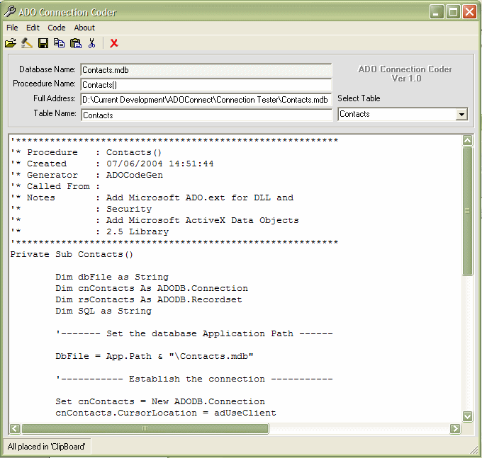



## ADO Connection Coder

### Description

This little utility allows the user to select an Access database and then generates the code

to make a connection. It also allows the user to select a table from the database which then

generates a simple SQL.

Also attached are instructions for use and a test program

If there is sufficient interest I will continue to develope code writing programs and submit

them to PlanetSourceCode.

Although a few votes would be nice I am more interested in feedback.

Taken from an idea by Carlos Vara, thanks.
 
### More Info
 
The code to make a connection

             |
---                |---
**Submitted On**   |2004-06-07 11:12:38
**By**             |[John](https://github.com/Planet-Source-Code/PSCIndex/blob/master/ByAuthor/john.md)
**Level**          |Beginner
**User Rating**    |4.4 (40 globes from 9 users)
**Compatibility**  |VB 6\.0
**Category**       |[Databases/ Data Access/ DAO/ ADO](https://github.com/Planet-Source-Code/PSCIndex/blob/master/ByCategory/databases-data-access-dao-ado__1-6.md)
**World**          |[Visual Basic](https://github.com/Planet-Source-Code/PSCIndex/blob/master/ByWorld/visual-basic.md)
**Archive File**   |[ADO\_Connec175475672004\.zip](https://github.com/Planet-Source-Code/john-ado-connection-coder__1-54233/archive/master.zip)

